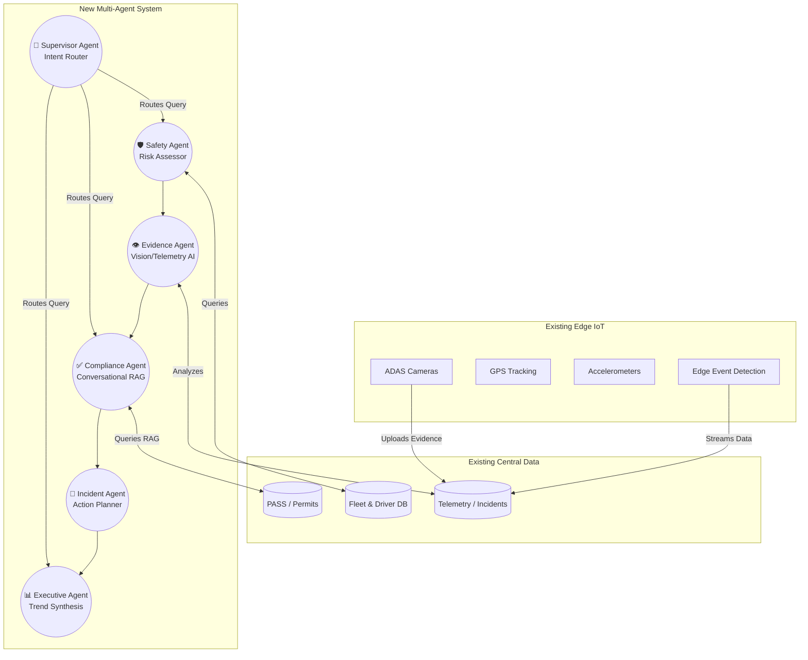

# Agentic Transformation of the ADEK School Transportation System

This document outlines how the newly developed **Agentic AI Platform** integrates with and enhances the existing Real-Time School Transportation Monitoring system. By overlaying multi-agent orchestration onto the existing IoT and data infrastructure, we transition the platform from a *passive monitoring dashboard* into an *autonomous, self-healing workflow engine*.

## 1. System Integration Overview

The existing system provides robust data ingestion (Edge AI, GPS, Telemetry, and RAG Policies) and basic alerting. The **Agentic Layer (LangGraph)** sits on top of this "Central Platform Layer" to provide autonomous decision-making, natural language reasoning, and automated compliance enforcement.

---

## 2. Mapping Agentic Intelligence to Existing Requirements

The table below explicitly maps the existing system requirements (from the PRD) to the new AI Agent capabilities.

| PRD Section | Existing System Capability | New Agentic Intelligence Enhancement |
| :--- | :--- | :--- |
| **3.2 Edge AI and IoT** | Edge detects "Harsh Braking" and uploads evidence. | **Evidence Agent**: Instead of just logging the event, the agent *reads the raw G-force telemetry* and evaluates if the harsh braking was a true violation or a necessary evasive maneuver. |
| **3.3 Safety Event Detection** | System detects driver distraction and generates an alert. | **Safety Agent**: Automatically assesses the *immediate physical risk level* (High/Medium/Low) based on the event context, student presence, and vehicle status. |
| **3.4 Compliance & Regs** | System tracks certifications and flags expired training. | **Compliance Agent**: A conversational chatbot that cross-references the driver's PASS profile against the ADEK Policy RAG database to determine exactly *which regulatory rule* was violated and the mandated penalty. |
| **3.5 Workflow Automation** | System triggers notifications and escalation. | **Incident Agent**: Synthesizes the analysis from the Safety, Evidence, and Compliance agents to formulate a comprehensive *Resolution Plan*, automatically deciding if a fine should be issued or a ticket closed. |
| **3.6 Route Optimization** | System analyzes historical data to recommend routes. | **Route Opt Agent** *(Future/Phase 2)*: Dynamically recalibrates routes if the Safety agent grounds a bus due to inspection failure, dispatching stand-by vehicles autonomously. |
| **4.0 Analytics & Reporting** | Dashboard provides live operational KPIs. | **Executive Agent**: Reads real-time DB counts (open incidents, pending training) and generates a natural language *C-Suite Strategic Summary* for stakeholders. |

---

## 3. The LangGraph Orchestration Flow

To achieve "Agentic Intelligence," the system utilizes **LangGraph** to create a State Graph. When an event occurs (e.g., an Edge IoT trigger or a user query), the following automated loop is executed:

1. **User Query / IoT Event**: Trigger enters the system.
2. **Supervisor Agent**: The LLM determines the *intent* of the input and routes it to the appropriate specialized agent.
3. **Cross-Agent Handoff**: 
   - *Example: Safety Incident* 
   - The **Safety Agent** evaluates the physical risk. 
   - It routes to the **Evidence Agent** to verify the raw camera telemetry.
   - It routes to the **Compliance Agent** to check if the driver's permit should be suspended based on ADEK rules.
   - It routes to the **Incident Agent** to log the final resolution.
4. **Actionable Output**: The platform executes the final action (e.g., dispatching an SMS via the Notification MCP) without human intervention.

## 4. Next Steps for Production Deployment

To finalize the integration of this agentic overlay into the existing platform architecture:
- [ ] **Webhook Integration**: Connect the Edge Gateway directly to the `/api/agents/run_scenario` endpoint to trigger agents asynchronously.
- [ ] **MCP Standardization**: Ensure all external Government Systems (PASS) are wrapped in standard Model Context Protocol (MCP) tools for the Compliance Agent.
- [ ] **WebSockets**: Push live agent conversational reasoning (the new UI chat bubbles) directly to the Operations Dashboard via WebSockets for zero-latency monitoring.
