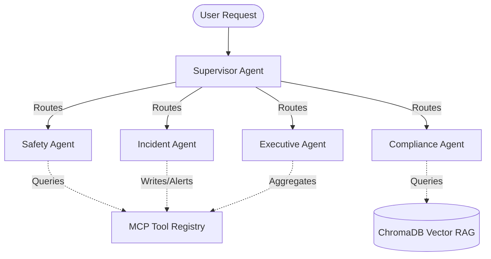

# Architectural Review: ADEK School Transportation AI Compliance Platform

An honest evaluation, justification, and critique of the LangGraph, RAG, and Model Context Protocol (MCP) tool integration.

---

## 1. System Overview

The platform uses a stateful multi-agent system built on **LangGraph**. The workflow starts with a centralized **Supervisor Agent** (acting as a routing coordinator) that dispatches tasks to four specialized domain agents:

Each agent utilizes a shared Model Context Protocol (MCP) registry to perform read/write actions on the system's operational database (SQLite) and local regulation index (ChromaDB).

---

## 2. Justification of the Architecture

### Stateful Multi-Agent Separation of Concerns
Attempting to handle safety checklists, policy lookups, database logging, and executive reporting inside a single LLM loop leads to prompt bloat and instructions conflict. Decoupling roles into specialized nodes (e.g., `Safety` for camera/SOP alerts, `Compliance` for legal auditing) ensures high precision and simpler, domain-focused prompts.

### In-Process Model Context Protocol (MCP)
By designing tools as standardized JSON-RPC functions registered via a central decorator (`@mcp_registry.register_tool`), the application aligns with standard LLM tools protocols. In production, these python modules can be converted into standalone MCP servers communicating over stdio or SSE transport with minimal code changes.

### Robust Fallback Pipeline
For enterprise client demonstrations, external API access (e.g., to Google Gemini or OpenAI) is frequently restricted or blocked by firewalls. The custom logic pipeline acts as a fallback: if the `GEMINI_API_KEY` is not present, it dynamically retrieves SQLite records and outputs structured text without crashing, upgrading to real LLM generation automatically when keys are provided.

---

## 3. Honest Architectural Criticisms & Trade-offs

### 1. Manual State Merging
*   **Criticism**: Nodes return `{**state, "conversation_history": history}`. In large-scale, concurrent, or cyclic LangGraph systems, this pattern leads to state overwrites.
*   **Friction**: LangGraph provides built-in reducers (e.g., `Annotated[list, add]`) that merge list keys automatically. The current implementation relies on manual manipulation, which is brittle if graph topology grows complex.

### 2. Client Recreation Overhead
*   **Criticism**: The RAG queries in `vector_db.py` re-initialize `chromadb.PersistentClient(path=settings.CHROMA_DB_PATH)` on every invocation.
*   **Friction**: Re-opening database connections and reading the SQLite state inside the vector path for every query incurs substantial file I/O latency. A global thread-safe singleton connection should be initialized at server startup.

### 3. Context Length Accumulation
*   **Criticism**: As agents run sequentially, the entire RAG search output and DB records are appended to `conversation_history` and passed inside state.
*   **Friction**: In a long multi-agent loop, this context size increases LLM input cost and risks token limit saturation. The system lacks a summary/compaction layer to prune older steps.

### 4. Rigid Routing Controls
*   **Criticism**: The Supervisor Agent uses strict conditional pathways based on pre-defined scenarios rather than letting the LLM dynamically decide when a step is fully resolved.
*   **Friction**: While this guarantees safety and deterministic behaviour (crucial for compliance), it restricts conversational agility and prevents the LLM from trying alternative problem-solving routes.

---

## 4. Production Roadmap Recommendations

1.  **Introduce Annotations and Reducers**: Refactor `AgentState` to use LangChain `messages` list with the `add_messages` reducer to safely merge concurrent state.
2.  **Singleton Client Pool**: Change `_get_client()` in `vector_db.py` to instantiate the ChromaDB client once during lifespan startup and store it on `app.state`.
3.  **Standalone MCP Server Deployments**: Wrap `backend/mcp/` modules using the official `mcp` SDK to expose them over SSE endpoints, separating the tool execution runtime from the API gateway.
